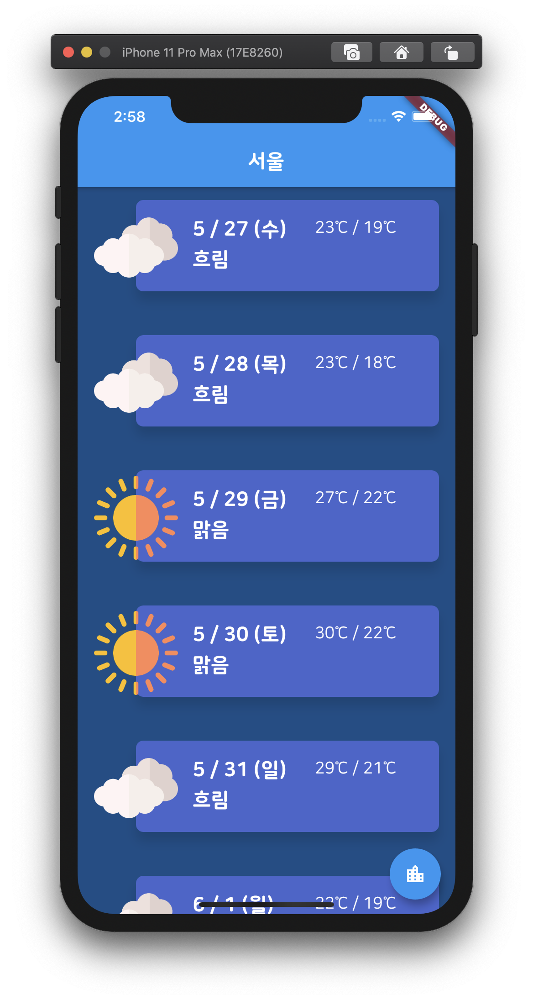
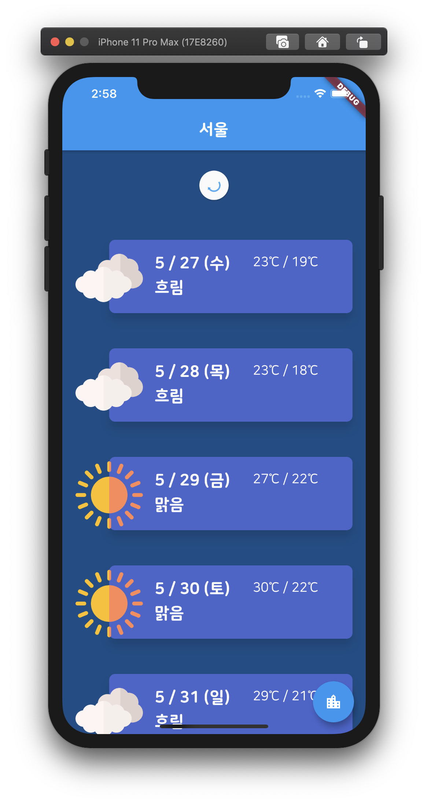
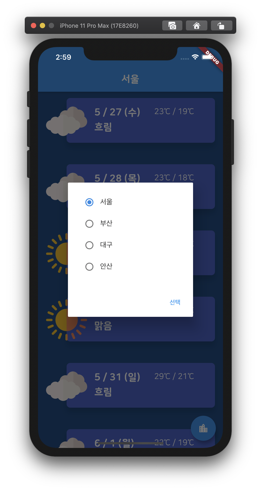

# Weather App
2019084984 임기성<br>
OSS-dev Week7 Assignment<br>
Weather Application<br>

## Prerequisites
Required | Description
--|--
[Flutter](https://flutter.dev/) | 1.17.1

### Main
```
메인 페이지.
각 카드에 날짜별 날씨 정보가 담겨있다.
```

<br>

### Refresh
```
리스트를 위로 Drag 하면 새로고침 기능을 사용할 수 있다.
```

<br>

### Region
```
오른쪽 아래 버튼을 클릭하여 원하는 지역을 선택할 수 있다.
```
